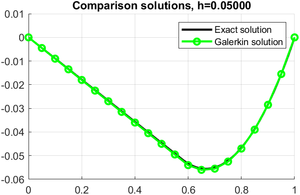

# Metodi analitici e numerici per l'ingegneria (a.k.a. Analytical and numerical methods for engineering)

The aim was to learn some of the techniques used by computers to handle real-world problems and to keep track of the approximation generated in the final solution.

In the second half of the course we were talking about solving differential equations and all the problem related such as Cauchy problems, boundary conditions, etc. The code here is mostly about solving differential equations, but also about solving systems of linear equations and some other stuff.

The final part of the course was about Finite Element Method (FEM), and his implementation in Matlab using the Galerkian discretization algorithm.

## Some examples

<!-- 

 
<figcaption>Lagrange interpolation varying the polynomial degree</figcaption>

 -->

<!--  

 
<figcaption>SEIR model with a beta coefficient variable over time (the beta variable is the infection rate)</figcaption>

 -->

 

 
<figcaption>Simulation of the satellite trajectory approaching Earth due to hypotetical air resistance</figcaption>

<!--  

 
<figcaption>Simple application of the Galerkian method to a linear elastic element</figcaption>

 -->

 

 
<figcaption>Example of a Cauchy-Dirichlet problem and his solution (using a non-complete Fourier Series)</figcaption>

 

Some more images are available in the [img](./img) folder.